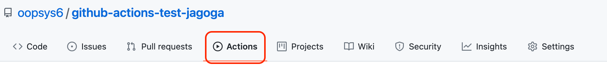
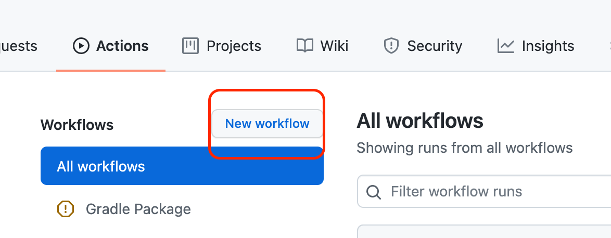
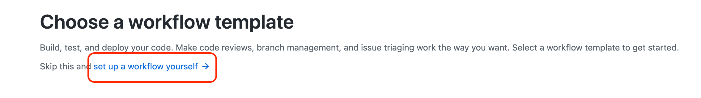
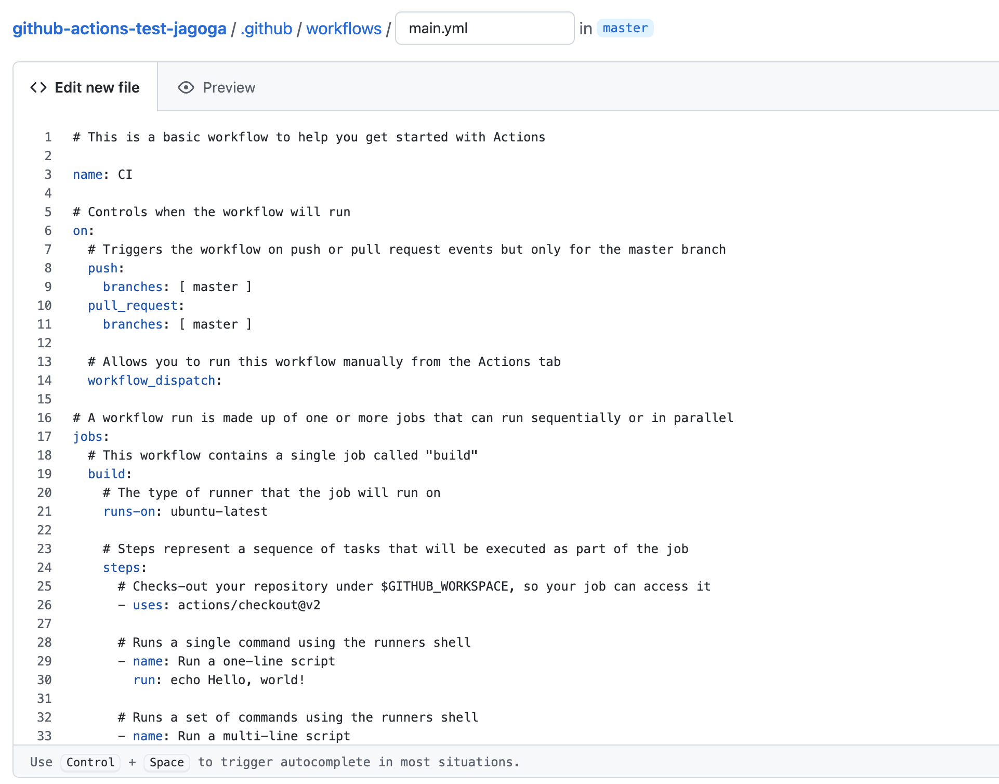
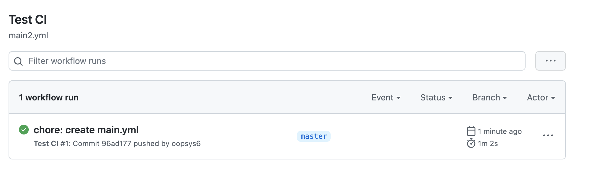
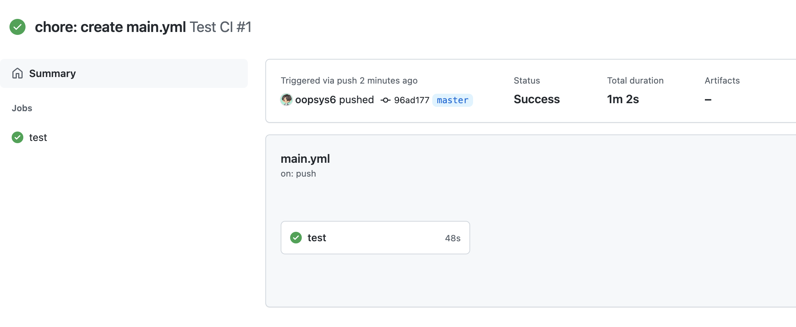
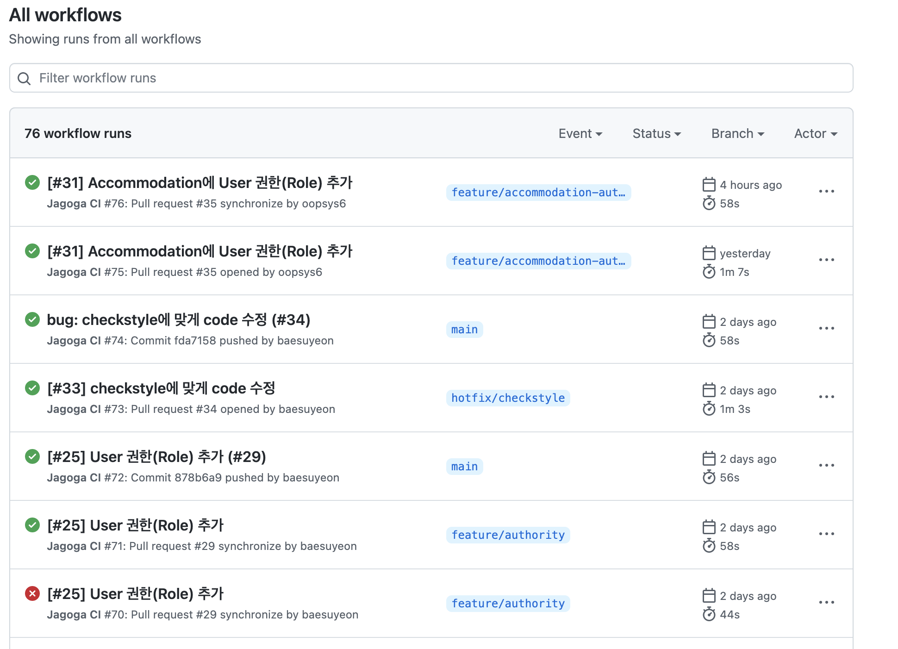

CI/CD는 애플리케이션 개발 단계를 자동화하여 애플리케이션을 보다 짧은 주기로 고객에게 제공하는 방법입니다. CI를 지속적인 통합, CD를 지속적인 배포라고 부르는데, CI 후에 CD를 하는 경우가 대부분입니다.

CI/CD를 할 수 있는 도구는 Jenkins, TravisCI 등 여러 가지 툴이 있는데, 이번 프로젝트에서는 github-actions를 사용하여 spring boot 프로젝트 CI(자동 test)를 진행해보도록 하겠습니다.


## 1. Workflow 생성하기

CI를 사용하고자 하는 github repository에 들어가서 상단에 'Actions' 탭을 누른 후 'New workflow'를 누릅니다.





저는 직접 set up을 해줄 것이기에 'set up a workflow yourself'를 선택합니다.



아래와 같이 yml 파일이 생성되는데 이 파일을 사용하여 Action workflow를 설정할 수 있습니다.
해당 파일은 repository에 등록한 프로젝트 최상단에 .github/workflow/*.yml 로 저장되는 것을 확인할 수 있습니다.

기본적으로 제공하는 것들을 살펴보겠습니다.

* <b>name: </b> Workflow의 이름
* <b>on: </b> Workflow의 Event
    * push, pull request 등 github event를 구독할 수도 있고 실행 브랜치를 제한할 수도 있습니다.
* <b>jobs: </b> job들을 병렬적으로 실행




## 2. yml 파일 수정하여 자동 테스트 구성하기

이름을 변경하고 push, pr을 진행할 브랜치를 선택한 다음 jobs에 test 관련 로직을 작성해주었습니다.

```yaml=
name: Test CI

on:
  push:
    branches: [ master ]
  pull_request:
    branches: [ master ]
    
jobs:
  test: 
    runs-on: ubuntu-latest 
    steps:
    - uses: actions/checkout@v2 
    - name: Set up JDK 11 
      uses: actions/setup-java@v1
      with:
        java-version: 11 
    - name: Grant execute permission for gradlew
      run: chmod +x gradlew
    - name: Test with Gradle
      run: ./gradlew test
```

파일을 수정하고 저장하면 다음과 같이 main.yml 파일이 테스트를 따로 실행하지 않아도 자동으로 테스트 된 것을 볼 수 있습니다.






## 3. 코드 작성 후 테스트 해보기

실제로 프로젝트에도 똑같이 적용하고 자동 테스트가 되는지 확인해보겠습니다.

프로젝트가 성공적으로 테스트 되었을 땐 **초록색 체크를, 실패했을 땐 빨간색 X**를 보여주고 있습니다.




## 4. 마무리

github-actions를 이용하여 간단하게 자동 test 환경을 구축해보았습니다.

직접 테스트를 하지 않고 자동으로 사용함으로써 생산적인 측면에서 이점이 있을 것 같습니다.

이후 github-actions를 사용하여 CI/CD까지 구축해보는 것도 포스팅해 보겠습니다 :)
