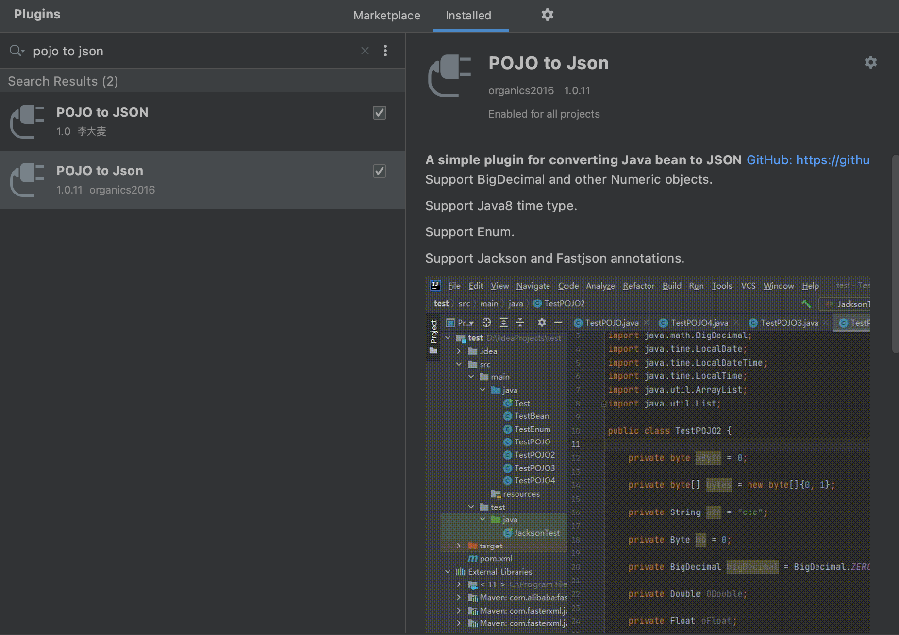
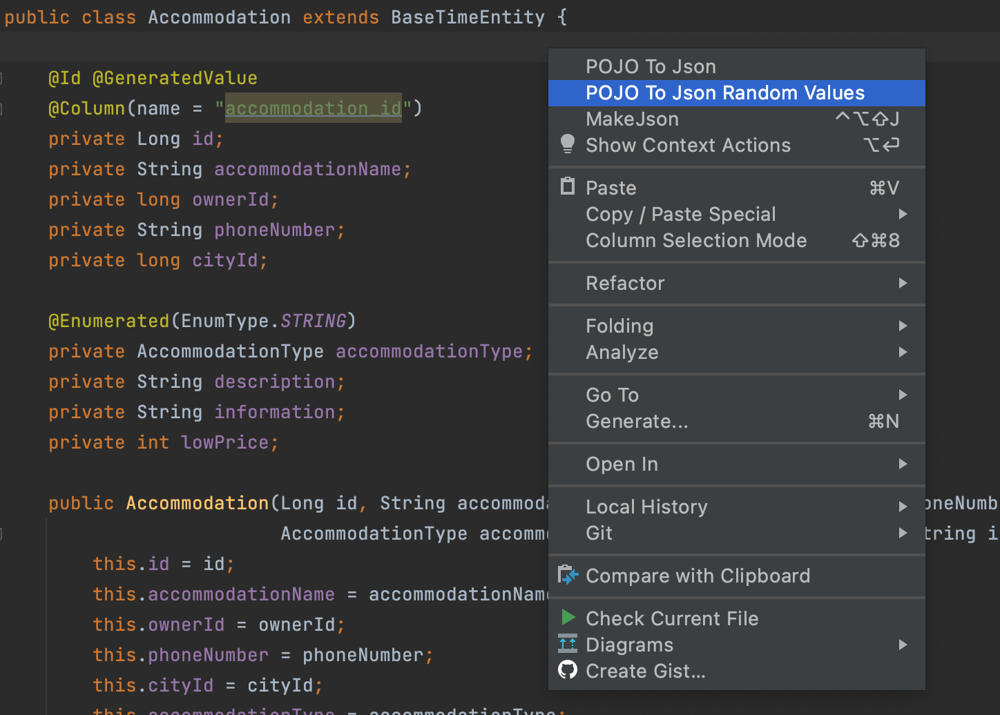
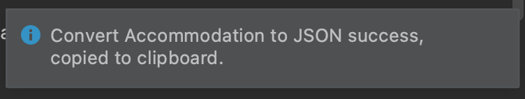
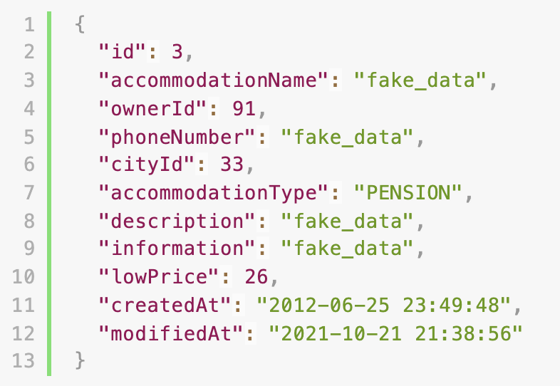

개발을 할 때, POJO를 JSON으로 변환해야 하는 상황들이 있습니다.
처음에는 POJO를 직접 JSON으로 매핑하는 노가다를 하였으나, 찾아보니 역시 게으른 개발자들이 이를 편하게 만들어주는 플러그인을 개발해두었습니다.

## 1. 설치 방법

Intellij에서 Preferences -> Plugins -> "POJO to Json" 을 선택합니다.

"pojo to json"을 선택하면 2가지가 존재하는데, 둘 다 사용해본 결과 아래 소문자로 되어 있는 것이 좀 더 편하였습니다.

## 2. 사용 방법

#### 2-1. 변환할 POJO 화면에서 오른쪽 키를 누릅니다.

#### 2-2. "POJO To Json Random Values"를 선택하여 JSON 데이터를 복사합니다. ("POJO To Json" 을 선택하여도 무관합니다. 랜덤 값의 유무 차이)

#### 2-3. 에디터를 사용하여 복사한 값을 붙여넣어 JSON 형식으로 확인해줍니다.

그러면 위와 같이 POJO가 JSON 형식으로 바뀐 것을 확인할 수 있습니다.
