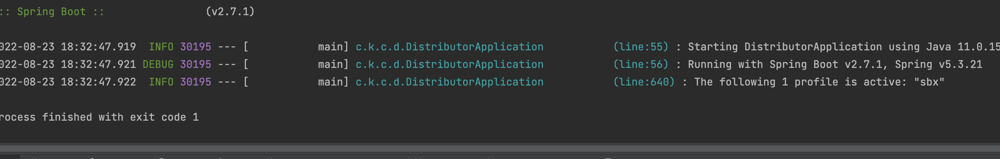
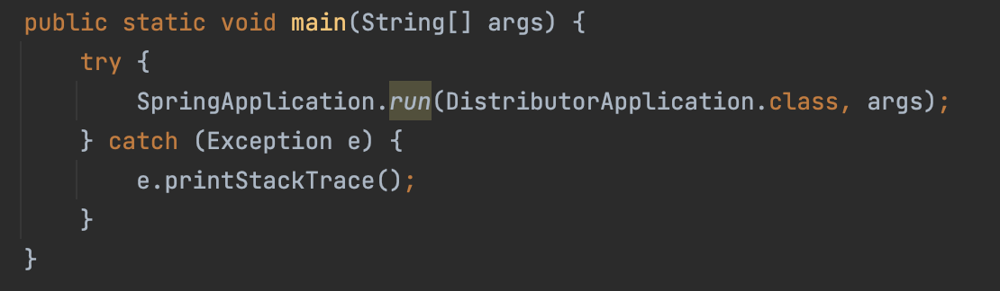
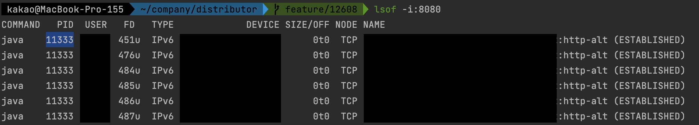
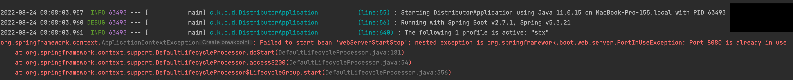
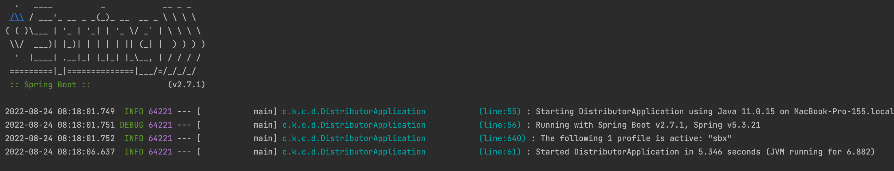

## 1. 문제 상황 정의하기

spring boot 프로젝트를 실행할 때 아무런 에러를 내뱉지 않고 프로젝트가 꺼지면 당황스럽다.

아래 사진을 보면 프로젝트 실행과 동시에 ‘process finished with exit code 1’과 함께 종료된다.

## 2. 해결하기

### 2-1. Main method에서 error 잡기

main 문에서 다음과 같이 try-catch를 사용해서 에러를 출력해보면 프로젝트에 무슨 문제가 있는지 알 수 있다.

### 2-2.Port 검색 후 종료

Mac에서는 lsof를 통해 해당 포트로 떠있는 프로세스를 검색할 수 있다.

출력된 에러의 내용처럼 **이미 8080 포트가 작동 중**이었고 그 **포트를 제거**해주면 된다

